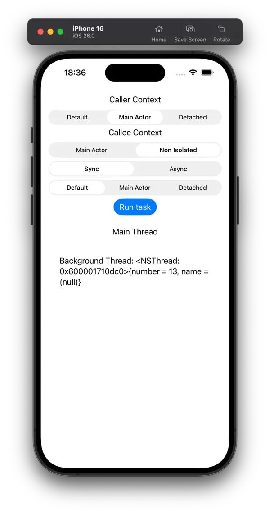

# Task explorations

This repository contains iOS app which aims at exploration of the behavior of Swift's `Task` and its actor isolation.  
It accompanies the article ["Task actor inheritance"](https://tomo.codes/blog/swift-task-actor-inheritance/) available on my blog.

The project contains experiments and demonstrations related to how tasks interact with actor isolation, threading, and concurrency in Swift.

Feel free to explore the code and refer to the article for my findings.

<picture> 
    <source srcset="./Documentation/media/tasks-explorations-app-dark.webp" media="(prefers-color-scheme: dark)"> 
     
</picture>